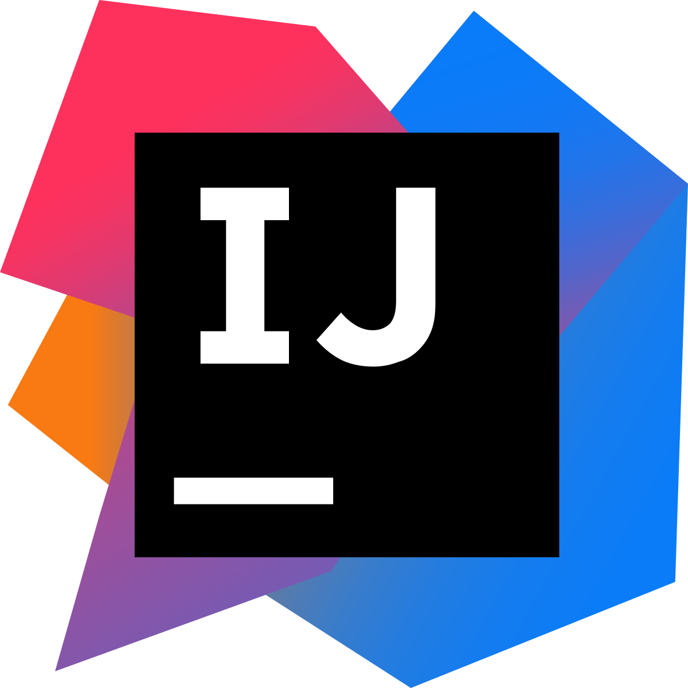

## Dynamic duo 

Using ESLint with IntelliJ is like having a coding buddy who's a neat freak. It's got a knack for spotting errors and keeping my code looking sharp, making coding feel like a fun game of "Spot the Mistake." Thanks to this dynamic duo, my code's become cleaner, and I've picked up a few coding tricks along the way. It's like having a wise coding sensei in the form of a tool – always there to guide me towards JavaScript perfection. No longer am I afraid of errors, the only thing that would keep me up at night is knowing whether or not my coding experience completely relies on the trust tool that is ESLint with Intellij.

## Intellij versus VSCode 

In my experience, IntelliJ takes the lead when comparing it to VSCode. While VSCode is undoubtedly a popular and versatile code editor, IntelliJ's strength lies in its Integrated Development Environment (IDE). IntelliJ offers a more holistic approach to software development with its powerful code analysis, debugging capabilities, and deep integration with various languages and frameworks. This makes it exceptionally well-suited for larger and more complex projects. While VSCode's lightweight nature and extensive library of extensions cater to many developers such as myself, IntelliJ's vast toolset and workflow seems to provide a more efficient and productive coding experience. 

## IntelliJ is intelligent 

In my perspective, IntelliJ makes a fantastic first impression primarily because of its user-friendly interface and comprehensive set of features. As a beginner, it can be daunting to dive into a new IDE especially when you are accustomed to another one, but IntelliJ's clean and intuitive layout eases that initial learning curve. It feels like a welcoming and supportive companion on your coding journey. The real-time code analysis and helpful suggestions empower you to write better code from day one. Plus, its seamless adaptability for multiple configurations within a few clicks makes it the perfect tool to accompany my coding adventure.
