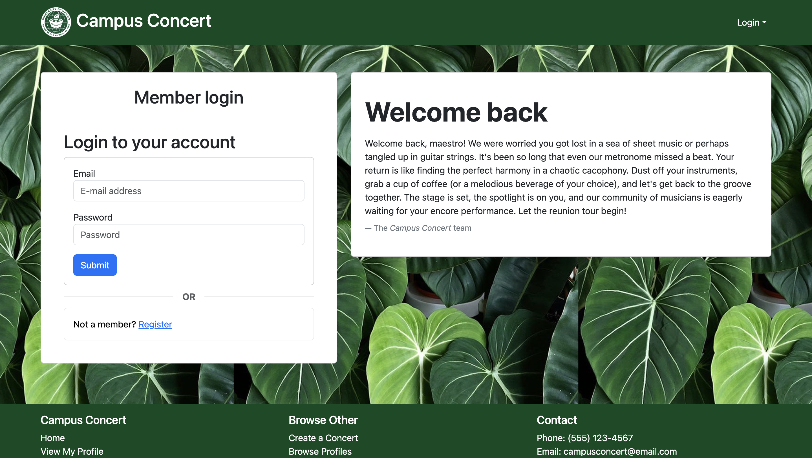

  

## Campus Concert: Where musicians alike can connect on Campus

Envision a vibrant digital venue aimed at balancing the melodic gifts of University of Hawaii at Manoa students. This web-application connects artists on campus in a dynamic way, encouraging cooperation and innovation. Aspiring artists can display their abilities, musical tastes, and hobbies through easily navigable profiles, promoting a diversified talent community. Through the site, users can organize and host their own "concerts," form bands virtually, and invite other like-minded people to participate in the musical experience. Musicians may plan practices, arrange shows or practices, and connect with others who share their passion for music all through a smooth interface, which helps to grow the college music scene. Whether your the next Bruno Mars or a budding pupil, Campus Concert is for everyone.

  

## Teamwork makes the dream work

The web-application we've built during ICS 314: Software Engineering, which links artists at UHManoa, was collaboratively created, and it has given me great insights in many different areas, those areas include software development, collaboration, communication, project and time management. My user experience design abilities and communcation have improved as a result of the process of creating and implementing the platform, and as as a team who thought through every issue and how it can be tackled, guaranteed that our application is user-friendly and entertaining for musicians. A few of the issues I've worked on this project included the functionality of the sign in and sign up page, creating tests for the functionality of pages such as browsing profiles, sign in, sign up, sign out, and improving the overall design of the website. We collaborated to realize our goal, therefore working as a team taught me the value of excellent communication and collaboration. Coding and database administration, two technical facets of web development, have become second nature to me, which has improved my comprehension on database data implementation on web-application. Seeing the platform grow from a concept to a useful tool for collaborative music has given me a sense of satisfaction and a greater understanding that through teamwork, discipline, and communication that teamwork really makes the dream work. My technical skill set has grown as a result of this project, which has also given me practical experience in problem-solving, challenge-taking, time management, communication and utilizing technology to enhance campus life and beyond. For my first team-based project, I must say it turned out quite well!

Check out the documentation: [Campus Concert documentation](https://campus-concert.github.io/).
Check out the website: [Campus Concert](https://campus-concert.com/).
Codebase can be found [here](https://github.com/campus-concert/campus-concert).
