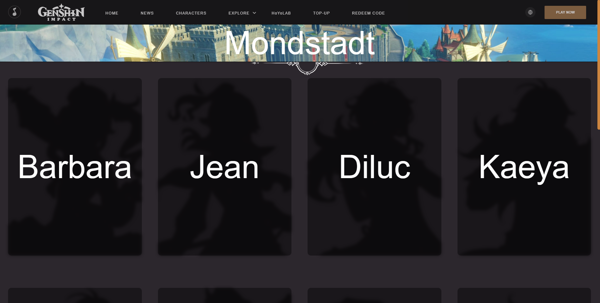
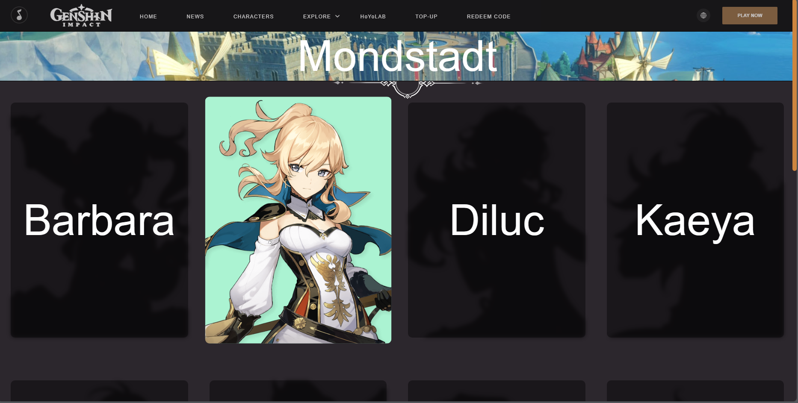
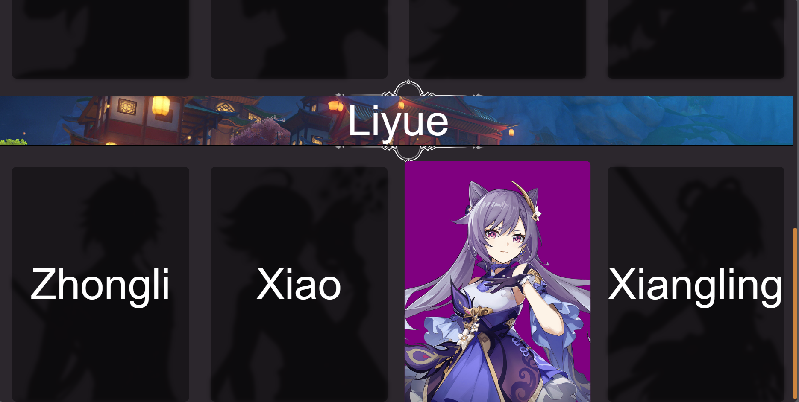

  

  This website features characters from the gacha game called "Genshin Impact". The links above are functional which takes you to the official Genshin Impact website. On the top left, it also toggles music that also derives from the game. All this was done by linking HMTL, CSS, and Javascript together without use of a framework using Visual Studio Code as an IDE. I've also customized a bit of the scroll bar as well to make it brown and a little rounded.

  
  

As you scroll over character boxes, the font dissapates and the silhouettes come to life. The respective character shows and is accompanied by their element type as their background. You get to see all different types of characters and there elements all seperated by their own region. So far I've only covered two regions. 

Building a website using HTML, CSS, and JavaScript has been an enlightening journey. HTML forms the foundation, providing the structure and content, while CSS adds style and aesthetics. JavaScript, on the other hand, injects interactivity and dynamic features. Through this process, I've gained a comprehensive understanding of web development, from the basics of markup and styling to the intricacies of scripting. I've learned the importance of clean and organized code, responsive design for various devices, and the ability to troubleshoot and debug effectively. Moreover, I've come to appreciate the power of continuous learning in the ever-evolving field of web development, as it allows me to create engaging and user-friendly online experiences.

This website was not officially launched.
