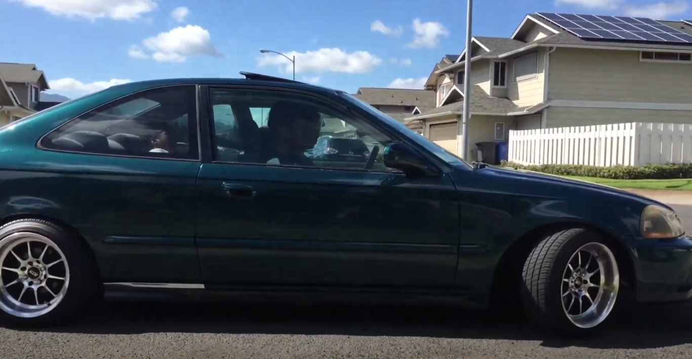
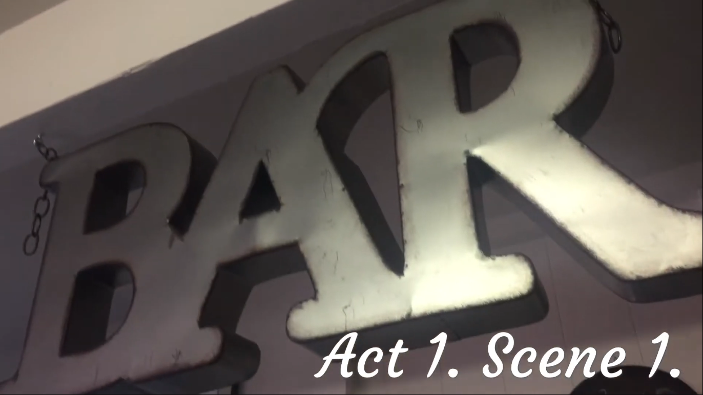

  
  

During my senior in highschool, we formed groups with each group having a unique scene that they have to reenact in Othello. Our group had the opportunity to do the very first scene that would occur in Othello, although with a little twist; both the setting, acting, and language does not take on the form of early modern english, but rather todays modern times. What would be castles in the original script, would be houses in ours. What would be horses, would be cars. Even the language changes from traditional middle english to todays modern english we are used too. 

The scriptwriting, editing, and directing were managed by me but tweaked a bit from my group and published and presented in class in about 5 days time. One thing to note, we added a bit of silly things that occur in the scenes, but dont mind them, as some of our friends outside our group were a little bored. 

Dive in and watch the video! https://www.youtube.com/watch?v=RwJQhmDXETE&t=210s
